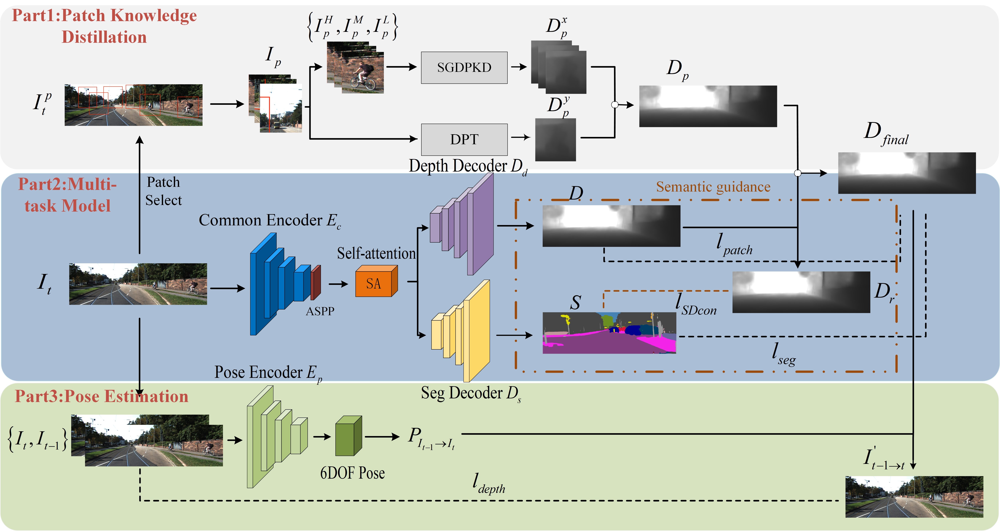

# **Semantic-Guided Monocular Depth Estimation Based on Patch Knowledge Distillation**

## Introduction
This repository contains the implementation of the Semantic-Guided Monocular Depth Estimation model based on Patch Knowledge Distillation, developed by Wang Bin from Nanjing University of Information Science and Technology.

The model enhances depth estimation accuracy through explicit constraints from semantic segmentation, focusing on refining depth estimation contours.

### Result3

| Method | Train | BackBone | Abs Rel | Sq Rel | RMSE | RMSE log |δ < 1.25 | δ² < 1.25 | δ³ < 1.25 | 
|--------|---------|---------|---------|---------|---------|---------|---------|---------|---------|
| Ours | M+Se |ResNet50|0.095|0.685|4.365|0.171|0.882|0.965|0.985|
| Ours(288x960) | M+Se|ResNet50|0.091|0.671|4.222|0.169|0.896|0.966|0.985 |
| Ours(384x1280) |M+Se|ResNet50|0.088|0.645|4.151|0.165|0.905|0.967|0.986|

## Modules

### 1. Semantic-Depth Consistency Loss
We devised a semantic-guided monocular depth estimation model based on patch knowledge distillation . This model incorporates a semantic depth consistency loss, ensuring that pixels with the same semantic label possess consistent relative depth.

### 2. Patch Knowledge Distillation Module
We improved the patch-based depth refinement method by employing dual networks (self+DPT) to estimate multi-scale patch depths. These patch depths are fused using contour masks. We incorporate this approach into model training, achieving patch-based knowledge distillation via the patch loss function.

### 3. Block Self-Attention Mechanism
We introduced a block-wise self-attention module in the decoder to enhance the extraction capability of deep features. Compared to conventional attention modules, the block-wise approach reduces the computational load of the model.

## Requirements
- Python 3.9
- Dependencies listed in `requirements.txt`

